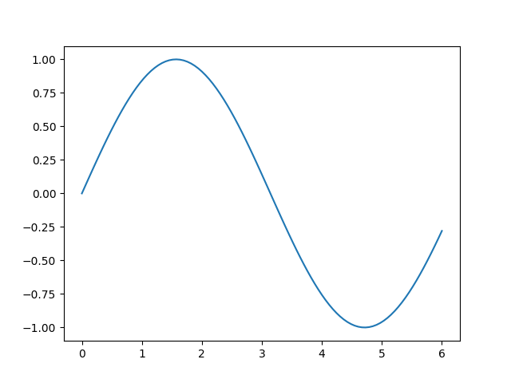

# Example report

This is example report, showing how to include text, tables, figures and inline
values.

## Features

 - What do you get when you multiply six by nine? 42. (inline value)
 - Math: $`\delta = 1`$ (not really related to the pyreport library)
 - Tables
 - Plots

## Table

<table>
<tbody>
<tr><td style="text-align: right;">0.622796 </td><td style="text-align: right;">0.405135</td><td style="text-align: right;">0.846443</td><td style="text-align: right;">0.77914 </td><td style="text-align: right;">0.790822 </td></tr>
<tr><td style="text-align: right;">0.375738 </td><td style="text-align: right;">0.902817</td><td style="text-align: right;">0.878925</td><td style="text-align: right;">0.210507</td><td style="text-align: right;">0.991275 </td></tr>
<tr><td style="text-align: right;">0.309621 </td><td style="text-align: right;">0.431418</td><td style="text-align: right;">0.287917</td><td style="text-align: right;">0.602999</td><td style="text-align: right;">0.341338 </td></tr>
<tr><td style="text-align: right;">0.115831 </td><td style="text-align: right;">0.65289 </td><td style="text-align: right;">0.435801</td><td style="text-align: right;">0.30011 </td><td style="text-align: right;">0.197978 </td></tr>
<tr><td style="text-align: right;">0.0479354</td><td style="text-align: right;">0.487332</td><td style="text-align: right;">0.990028</td><td style="text-align: right;">0.7369  </td><td style="text-align: right;">0.0563672</td></tr>
</tbody>
</table>

## Figure

----
This report was generated using [pyreports]().