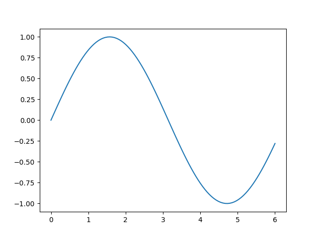

# Example report

This is example report, showing how to include text, tables, figures and inline
values.

## Inline value

What do you get when you multiply six by nine? 42.

## Table

<table>
<tbody>
<tr><td style="text-align: right;">0.310564</td><td style="text-align: right;">0.983198</td><td style="text-align: right;">0.483289 </td><td style="text-align: right;">0.729054</td><td style="text-align: right;">0.473043 </td></tr>
<tr><td style="text-align: right;">0.372847</td><td style="text-align: right;">0.37358 </td><td style="text-align: right;">0.335721 </td><td style="text-align: right;">0.544693</td><td style="text-align: right;">0.0656415</td></tr>
<tr><td style="text-align: right;">0.765205</td><td style="text-align: right;">0.772442</td><td style="text-align: right;">0.286279 </td><td style="text-align: right;">0.276836</td><td style="text-align: right;">0.407552 </td></tr>
<tr><td style="text-align: right;">0.545736</td><td style="text-align: right;">0.357768</td><td style="text-align: right;">0.845538 </td><td style="text-align: right;">0.187104</td><td style="text-align: right;">0.320955 </td></tr>
<tr><td style="text-align: right;">0.857037</td><td style="text-align: right;">0.145393</td><td style="text-align: right;">0.0768296</td><td style="text-align: right;">0.489752</td><td style="text-align: right;">0.707397 </td></tr>
</tbody>
</table>

## Figure

----
This report was generated using [pyreports]().